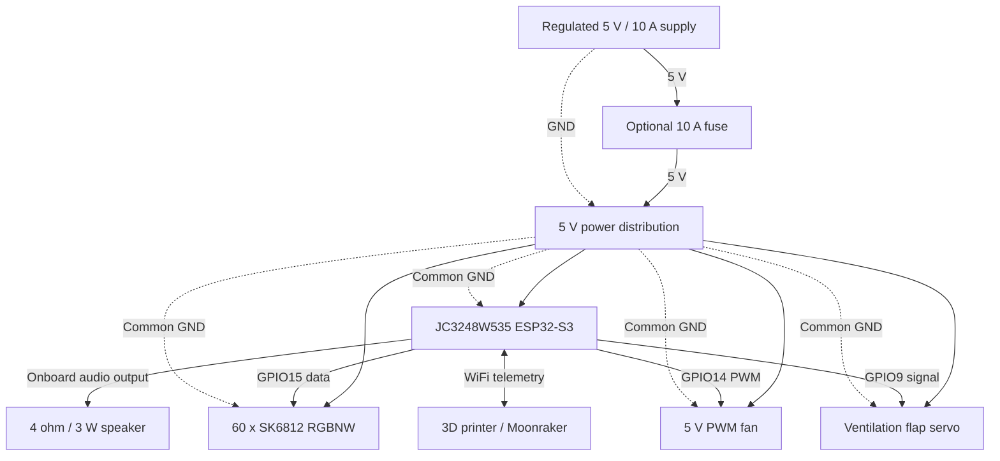
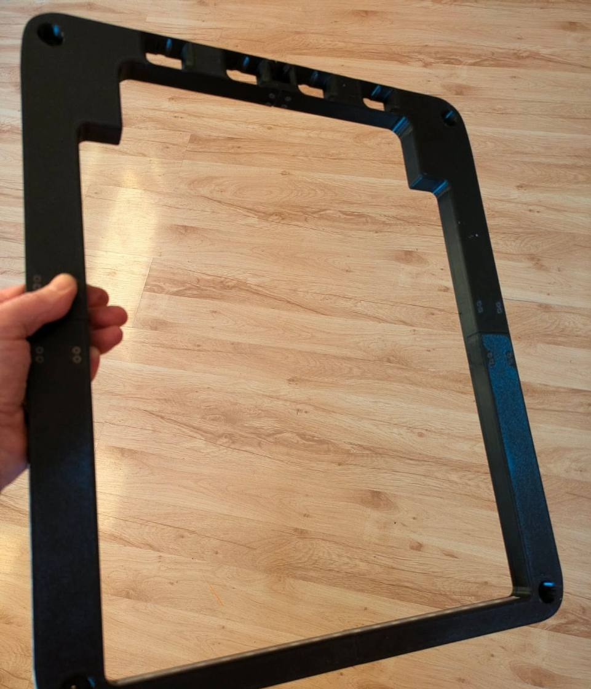
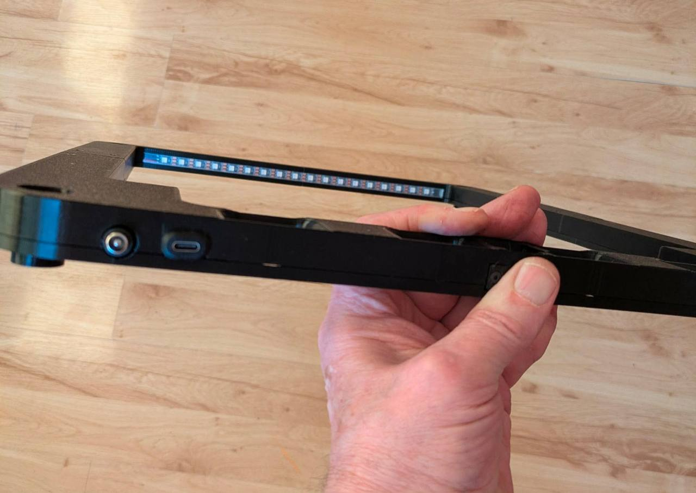
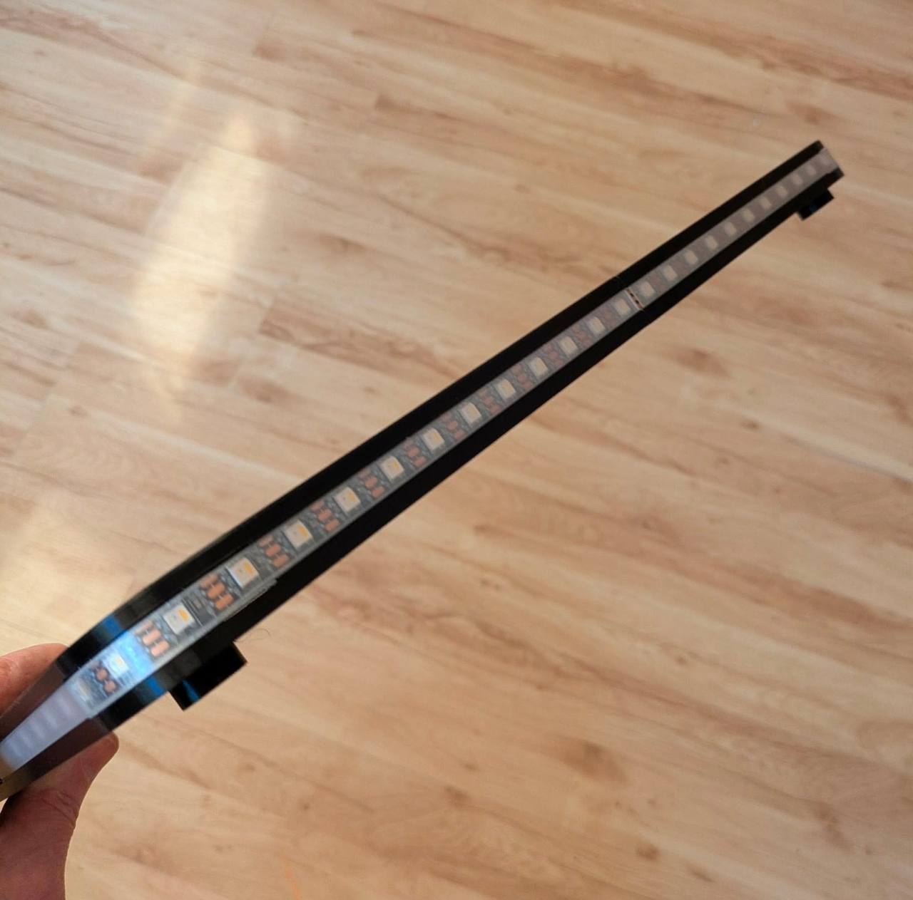

# coroNET OS 2 Assembly And Wiring

This guide describes the shared coroNET hardware used by OS 2. Firmware development is active, but the physical GPIO layout is intentionally inherited from coroNET OS 1.

> Disconnect power while assembling. Verify the exact board revision, connector labels, polarity, and firmware pin definitions before applying 5 V.

## System Layout

## GPIO Map

| Function | GPIO | Notes |
| --- | ---: | --- |
| SK6812 data | `15` | RGBW LED data output |
| SK6812 SPI dummy clock | `16` | Used by the SPI encoding driver; leave unconnected |
| Servo flap signal | `9` | PWM control |
| Fan PWM | `14` | PWM/control input, not fan power |
| Optional chamber-heater control | `46` | Active-HIGH 3.3 V logic output only; external isolated/driver stage required |
| I2S BCK | `42` | Integrated board audio path |
| I2S LRCK | `2` | Integrated board audio path |
| I2S DOUT | `41` | Integrated board audio path |
| SDMMC CLK | `12` | Integrated microSD slot |
| SDMMC CMD | `11` | Integrated microSD slot |
| SDMMC D0 | `13` | Integrated microSD slot |

LED indices such as `42..59` are positions in the LED strip, not GPIO numbers.

## Suggested Wire Colors

| Circuit | Color |
| --- | --- |
| 5 V | Red |
| GND | White |
| LED data | Green |
| Fan PWM | Yellow |
| Servo signal | Brown |
| Audio path in diagrams | Blue |

Physical speaker leads are normally red for `+` and black for `-` regardless of diagram color.

## Power Distribution

- Route supply `+5V` through the optional fuse to a suitable distribution point.
- Connect supply ground directly to the distribution ground.
- Power the controller, LEDs, fan, and servo from appropriately rated 5 V wiring.
- Connect every module to common ground.
- Do not route LED, fan, or servo current through ESP32 GPIO pins or thin logic traces.
- Place a 1000 uF / 10 V electrolytic capacitor across LED `5V` and `GND` near the first LED. Observe polarity.
- Keep high-current wiring mechanically secure, insulated, and strain relieved.

## LED Layout

Use one 60-pixel SK6812 RGBNW strip.

| Physical section | Indices | Count |
| --- | --- | ---: |
| Right outer | `0..10` | 11 |
| Center/front outer | `11..30` | 20 |
| Left outer | `31..41` | 11 |
| Inside | `42..59` | 18 |

Connect LED `DIN` to `GPIO15`, `5V` to the power distribution, and `GND` to common ground. Keep the data path short. An SN74AHCT125N level shifter near the LED input is recommended for product-style wiring.

## Speaker

Connect the 4 ohm / 3 W speaker to the board's speaker output using its red `+` and black `-` leads. Do not connect the speaker directly to GPIO41 or another ESP32 pin; those pins feed the integrated audio path on the controller board.

## Servo And Fan

Servo:

- signal to `GPIO9`;
- VCC to the 5 V distribution;
- GND to common ground.

Fan:

- PWM/control input to `GPIO14`;
- fan power to the correct 5 V supply path;
- GND to common ground.

Verify servo endpoints before attaching the flap. A stalled servo can overheat and cause brownouts. A 2-wire fan requires a suitable transistor/MOSFET driver and must not be powered from GPIO14.

## Mechanical Order

1. Print [hardware/print/coroNET.3mf](hardware/print/coroNET.3mf).
2. Test-fit the display, speaker, fan, flap, LED strip, diffuser, and connectors.
3. Install inserts, spacers, or mounting hardware.
4. Fit the LED strip in the expected data direction.
5. Install the controller and speaker.
6. Install the fan, servo, and flap without forcing their travel.
7. Route signal wiring away from high-current LED and motor wiring.
8. Add the LED capacitor and optional fuse.
9. Verify common ground and continuity.
10. Perform first power-up with current limiting when available.

## Visual Assembly Reference

The reference build uses a printed frame that combines the outer LED channel with accessible power and USB-C controls. The separate inside-light module positions its strip to cast useful white light downward into the work area.

<table>
  <tr>
    <td width="50%"></td>
    <td width="50%"></td>
  </tr>
  <tr>
    <td align="center"><strong>Complete printed frame</strong></td>
    <td align="center"><strong>Controls and protected outer LED channel</strong></td>
  </tr>
</table>

  

The inside-light module before installation. Photographs by @wlodeka on Discord.

More installed views are available in the [coroNET Build Showcase](docs/COMMUNITY_SHOWCASE.md).

## Before First Power-Up

- verify no short exists between 5 V and GND;
- verify power polarity at every connector;
- verify LED `DIN` reaches `GPIO15`;
- verify servo signal reaches `GPIO9`;
- verify fan PWM reaches `GPIO14`;
- verify the speaker uses the onboard output;
- verify the capacitor polarity;
- disconnect the optional heater output until its external driver is separately validated.

The optional chamber-heater signal must only control a properly rated relay, transistor, optocoupler, or dedicated driver. Never connect a heater directly to the ESP32-S3. GPIO46 is also a boot strapping pin: the external driver input must remain high-impedance and must not pull the line HIGH while the controller starts.
