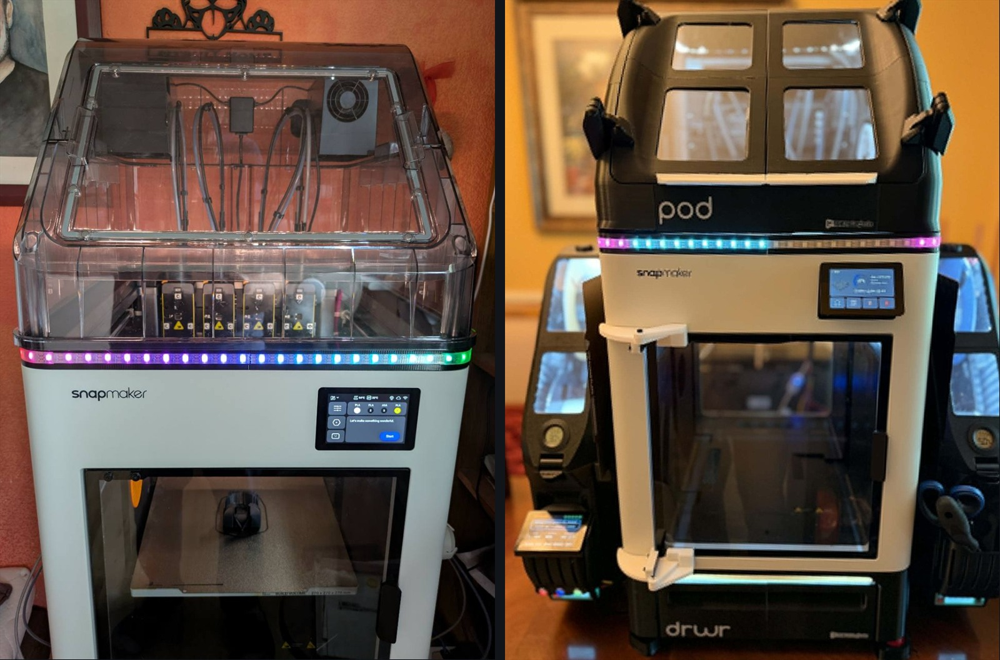
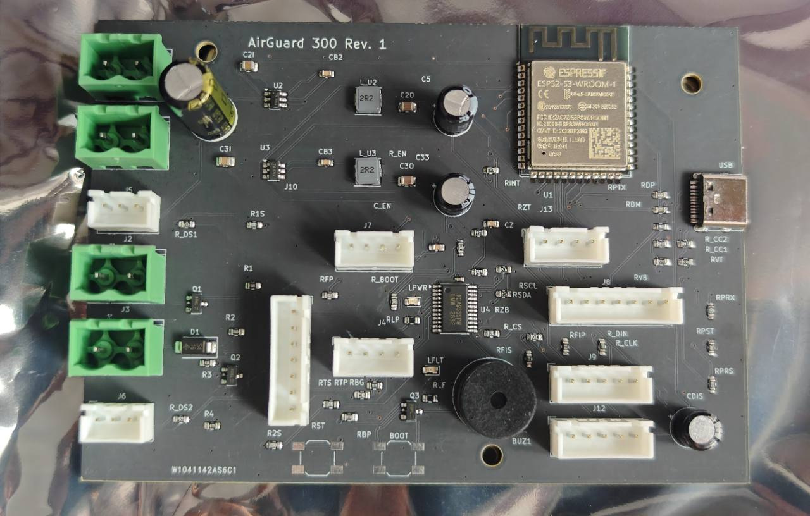
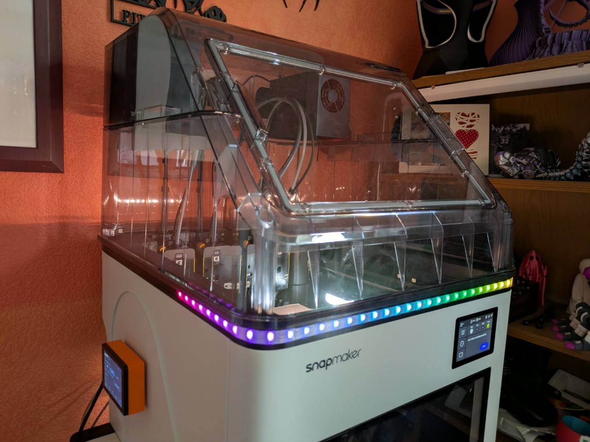
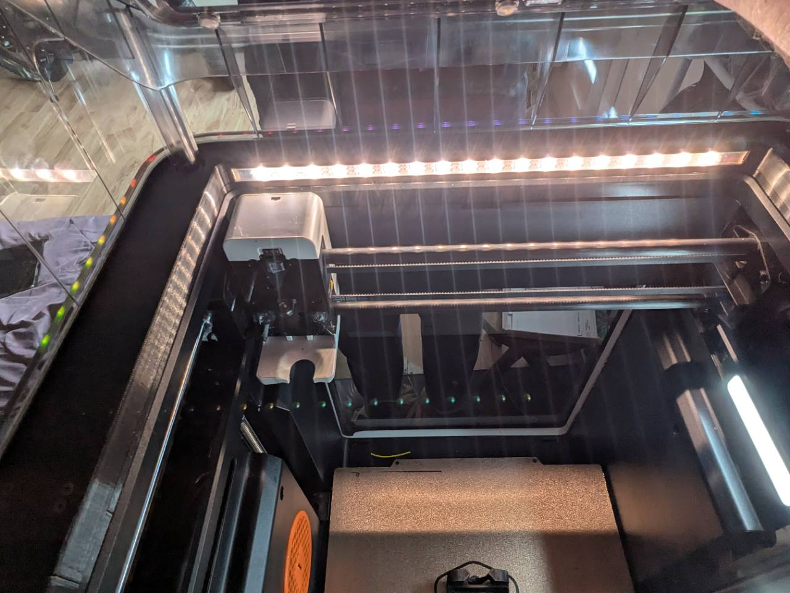

# coroNET OS 2

[](https://github.com/AlphaStudioDE/coroNET_OS_2/actions/workflows/firmware.yml)
[](LICENSE)


**coroNET OS 2** is an open-source touchscreen companion controller for 3D printers. It turns printer telemetry into a physical interface with status-aware RGBW lighting, sound, ventilation control, diagnostics, and phone connectivity.

OS 2 is a ground-up successor to [coroNET OS 1](https://github.com/AlphaStudioDE/coroNET_OS_1). It keeps the same physical hardware and GPIO layout while replacing the original monolithic firmware with a modular PlatformIO architecture designed for long-term stability, PSRAM-first memory use, and synchronized control from the touchscreen and Android companion app.

<p align="center">
  
</p>

> Two community-built coroNET installations, one shared hardware platform: **@wlodeka's coroNET OS 2 build with the original Snapmaker U1 Top Cover** and **Bobby Morgan's extensively customized machine running OS 1**. Photographs published with permission.

## Start Here

[Getting started](GETTING_STARTED.md) | [LED animation catalog](docs/LED_ANIMATIONS.md) | [Status sounds](docs/STATUS_SOUNDS.md) | [Community showcase](docs/COMMUNITY_SHOWCASE.md) | [Bill of materials](BOM.md) | [Assembly and wiring](ASSEMBLY.md) | [Flashing](FLASHING.md) | [Android app](android/README.md) | [Development updates](docs/UPDATES.md) | [Roadmap](ROADMAP.md) | [Architecture](docs/ARCHITECTURE.md) | [OS 1 feature scope](docs/OS1_FEATURE_SCOPE.md) | [Contributing](CONTRIBUTING.md)

**Latest downloads:** [firmware and Flash Tool](https://github.com/AlphaStudioDE/coroNET_OS_2/releases/latest) | [Android companion APK](https://github.com/AlphaStudioDE/coroNET_OS_2/releases/latest/download/coroNET_Companion.apk)

## What The Finished Device Is Designed To Do

- display printer state, progress, temperatures, active tool, material, job time, and connectivity;
- drive 60 SK6812 RGBW LEDs as logical right, center, left, and inside sections;
- render printer-aware animations from progress, filament color, temperatures, and events;
- play startup, status, finish, warning, and interaction sounds from microSD;
- control a PWM fan and servo-driven ventilation flap;
- provide setup, diagnostics, configuration, and OTA updates on a 3.5-inch touchscreen;
- synchronize settings and live state with an Android app over BLE or local WiFi;
- support multiple coroNET devices in one companion app;
- keep large buffers in PSRAM and reserve internal/DMA memory for hardware-critical work.

## On The Horizon: AirGuard 300

Another open-source project is taking shape alongside coroNET. **AirGuard 300** is a DIY chamber-heating platform being designed for Klipper printers with one deliberately ambitious goal: to set a new benchmark for safety in self-built chamber heating.

<p align="center">
  
</p>

<p align="center"><sub>AirGuard 300 Rev. 1 prototype controller board, designed by Damian Borkowski.</sub></p>

Future coroNET OS 2 releases are planned to recognize and work directly with AirGuard 300, bringing its guarded heating system, telemetry, and safety state into the same touchscreen and companion experience. Universal Klipper compatibility and open construction are part of the plan. The rest stays behind the workshop door for now.

> Two open projects. One connected ecosystem. More about AirGuard 300 will be revealed as its hardware and safety architecture reach public validation milestones.

## Community Showcase: coroNET in the Wild

coroNET is already living beyond the original prototype. Community builders are integrating it into original Snapmaker U1 Top Cover installations and extensively customized machines with multi-tool material handling, active ventilation, environmental monitoring, physical status lighting, and dedicated touchscreen control.

<table>
  <tr>
    <td width="33%"></td>
    <td width="33%"></td>
    <td width="33%"></td>
  </tr>
</table>

Explore the full **[Community Showcase](docs/COMMUNITY_SHOWCASE.md)** and see coroNET working with the original Snapmaker U1 Top Cover and as part of an extensively customized printer installation.

Featured installations built and photographed by **@wlodeka on Discord** and **Bobby Morgan**.

## Current Development Status

The current public firmware and Android companion release is **coroNET OS 2 0.3.2**. The repository remains open throughout development so that the architecture, documentation, hardware assumptions, and project history stay visible.

| Area | Status |
| --- | --- |
| PlatformIO project and MIT licensing | Released and maintained |
| JC3248W535 display and touch | Verified on reference hardware |
| PSRAM canvas and small DMA transfer windows | Verified on reference hardware |
| Versioned NVS settings | Working with live apply, revision tracking, and write debounce |
| Unique device identity and BLE peripheral | Working with confirmed pairing and framed protocol V2 |
| Local WiFi control panel, HTTP API, and mDNS | Working with responsive browser UI, isolated browser sessions, token authentication, and hostname recovery |
| First-run setup wizard | Working with WiFi validation and layered printer discovery |
| Moonraker realtime telemetry, HTTP fallback, and discovery | Working with WebSocket subscriptions, reconnect, and HTTP integrity checks |
| I2S audio output | Working with PSRAM staging and controlled startup/shutdown silence |
| SD-backed WAV playback | Working with indexed folders, status assignment, and asset validation |
| Home dashboard | Working with live printer and connectivity state |
| Settings and one-screen-at-a-time UI navigation | Working on reference hardware |
| LED, ventilation, and sound tabs | Working on reference hardware |
| Four UI skins, dark/light modes, clocks, and screen saver | Working on reference hardware |
| Android companion app for OS 2 | Public signed APK with adaptive landscape UI, BLE/WiFi reconnect, offline cache, conflict handling, SD sound browsing, and shared device controls |
| Layered RGBW LED engine | Working with ambient, dimming, mirror, calibration, and previews |
| PWM fan and servo flap | Working with calibration and fail-safe logic |
| Panda Breath workflows | Implemented with mDNS discovery and manual host configuration; physical Panda validation pending |
| DIY chamber-heater control | Implemented as a guarded GPIO46 logic output for an external driver |
| GitHub OTA, same-version reinstall, SD recovery, and automatic rollback validation | Public 0.3.2 release, Flash Tool package, checksums, and Android APK published together |

Versioned firmware packages are published under [GitHub Releases](https://github.com/AlphaStudioDE/coroNET_OS_2/releases). Development on the complete end-user experience remains active.

## Hardware

- JC3248W535 ESP32-S3 touchscreen controller, 16 MB flash and OPI PSRAM;
- SK6812 RGBNW strip, 60 LEDs;
- 5 V / 10 A power supply;
- 4 ohm / 3 W speaker using the board's integrated audio output;
- 5 V PWM fan and micro servo;
- 1000 uF / 10 V capacitor at the LED power input;
- printed enclosure and mounting parts from [hardware/print/coroNET.3mf](hardware/print/coroNET.3mf).

See [BOM.md](BOM.md) before purchasing and [ASSEMBLY.md](ASSEMBLY.md) before applying power.

## Build The Firmware

Install [Visual Studio Code](https://code.visualstudio.com/) and the [PlatformIO extension](https://platformio.org/install/ide?install=vscode), clone this repository, and run:

```powershell
pio run
pio run -t upload
pio device monitor
```

The target board definition is included in the repository. Detailed instructions and recovery notes are in [FLASHING.md](FLASHING.md).

## Local Browser Control

When coroNET and a phone or computer are on the same trusted WiFi network, open the device IP address or `http://coronet-xxxx.local/` in a modern browser. The responsive control panel is served directly by coroNET and mirrors live printer status plus LED animations, per-section brightness and DIMM, color calibration, ventilation failsafes, Panda Breath workflows, status sounds, clocks, time zones, Quiet Mode, and firmware updates. It does not require a cloud account, external server, or Internet connection.

The `xxxx` suffix matches the device identity shown by coroNET. Browser access is available while companion transport is set to **Auto** or **WiFi**; BLE-only mode deliberately stops the HTTP service.

## Repository Layout

```text
android/      native Android companion application
boards/       custom PlatformIO board definition
docs/         architecture, protocol, hardware, and technical notes
hardware/     printable mechanical files and hardware documentation
include/      project and LVGL configuration
src/          modular firmware services and local BSP
.github/      automated builds and project templates
```

Generated firmware binaries are intentionally excluded from Git history. Tested binaries, checksums, and factory flashing packages are attached to versioned GitHub Releases.

## Open Source

coroNET OS 2 is licensed under the [MIT License](LICENSE). Source code, documentation, and project-owned files in this repository may be used, modified, and redistributed under those terms unless a file explicitly states separate third-party terms.

Contributions, hardware validation, documentation corrections, and reproducible bug reports are welcome. Read [CONTRIBUTING.md](CONTRIBUTING.md) before opening a pull request.

## Safety

This project controls lighting, motors, fans, network-connected printer data, and high-current 5 V distribution. Verify polarity, common ground, insulation, wire current ratings, servo limits, fan behavior, and LED power before unattended use. Never power a heater, fan, servo, or LED strip directly from an ESP32 GPIO.

## Credits

Created and maintained by **Damian Borkowski**.

Special thanks to **@wlodeka** on Discord for hardware testing, feedback, and the optional magnetic enclosure developed for coroNET OS 1.

Special thanks to **Bobby Morgan** for building and testing an extensive four-tool coroNET installation and for contributing the photographs featured in the [Community Showcase](docs/COMMUNITY_SHOWCASE.md).

coroNET is an independent community project and is not affiliated with or endorsed by Snapmaker. Snapmaker and other product names may be trademarks of their respective owners.
