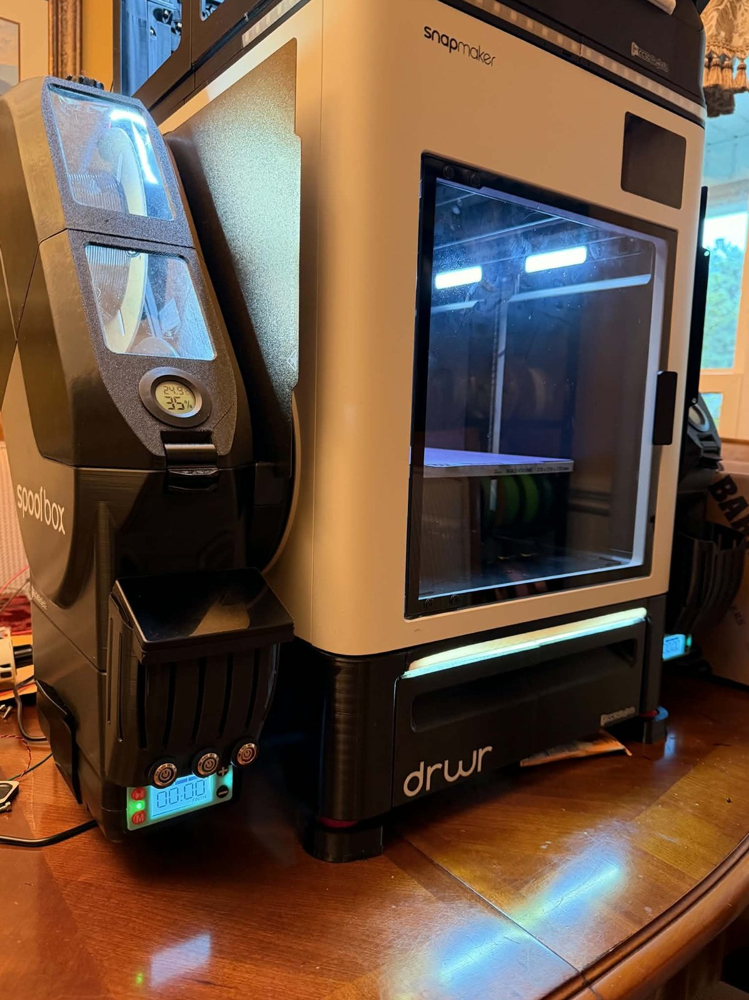
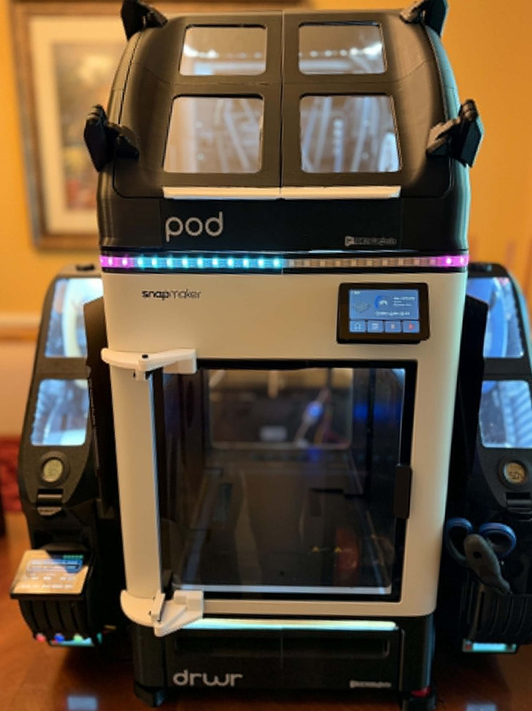
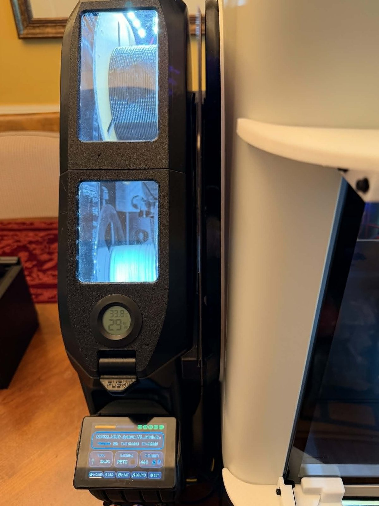
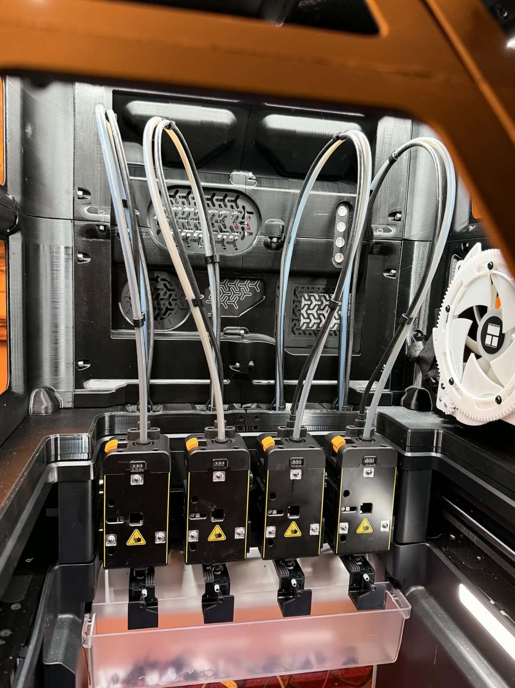

# coroNET OS 2

[](https://github.com/AlphaStudioDE/coroNET_OS_2/actions/workflows/firmware.yml)
[](LICENSE)


**coroNET OS 2** is an open-source touchscreen companion controller for 3D printers. It turns printer telemetry into a physical interface with status-aware RGBW lighting, sound, ventilation control, diagnostics, and phone connectivity.

OS 2 is a ground-up successor to [coroNET OS 1](https://github.com/AlphaStudioDE/coroNET_OS_1). It keeps the same physical hardware and GPIO layout while replacing the original monolithic firmware with a modular PlatformIO architecture designed for long-term stability, PSRAM-first memory use, and synchronized control from the touchscreen and Android companion app.

<p align="center">
  
</p>

> Bobby Morgan's community-built coroNET installation running OS 1 on the same controller hardware targeted by OS 2. Photograph published with permission.

## Start Here

[Getting started](GETTING_STARTED.md) | [LED animation catalog](docs/LED_ANIMATIONS.md) | [Status sounds](docs/STATUS_SOUNDS.md) | [Community showcase](docs/COMMUNITY_SHOWCASE.md) | [Bill of materials](BOM.md) | [Assembly and wiring](ASSEMBLY.md) | [Flashing](FLASHING.md) | [Android app](android/README.md) | [Development updates](docs/UPDATES.md) | [Roadmap](ROADMAP.md) | [Architecture](docs/ARCHITECTURE.md) | [OS 1 feature scope](docs/OS1_FEATURE_SCOPE.md) | [Contributing](CONTRIBUTING.md)

## What The Finished Device Is Designed To Do

- display printer state, progress, temperatures, active tool, material, job time, and connectivity;
- drive 60 SK6812 RGBW LEDs as logical right, center, left, and inside sections;
- render printer-aware animations from progress, filament color, temperatures, and events;
- play startup, status, finish, warning, and interaction sounds from microSD;
- control a PWM fan and servo-driven ventilation flap;
- provide setup, diagnostics, configuration, and OTA updates on a 3.5-inch touchscreen;
- synchronize settings and live state with an Android app over BLE or local WiFi;
- support multiple coroNET devices in one companion app;
- keep large buffers in PSRAM and reserve internal/DMA memory for hardware-critical work.

## Community Showcase: coroNET in the Wild

coroNET is already living beyond the original prototype. Community builders are integrating it into highly customized machines with multi-tool material handling, active ventilation, environmental monitoring, physical status lighting, and dedicated touchscreen control.

<table>
  <tr>
    <td width="33%"></td>
    <td width="33%"></td>
    <td width="33%"></td>
  </tr>
</table>

Explore the full **[Community Showcase](docs/COMMUNITY_SHOWCASE.md)** and see coroNET working as part of a real, extensively customized printer installation.

Featured installation built and photographed by **Bobby Morgan**.

## Current Development Status

The repository is public early so that the architecture, documentation, hardware assumptions, and development history are visible from the beginning.

| Area | Status |
| --- | --- |
| PlatformIO project and MIT licensing | Working |
| JC3248W535 display and touch | Working on hardware |
| PSRAM canvas and small DMA transfer windows | Working on hardware |
| Versioned NVS settings | Working, with live apply and write debounce |
| Unique device identity and BLE peripheral | Working, framed protocol V2 |
| Local WiFi HTTP API and mDNS | Token-authenticated implementation |
| First-run setup wizard | Working on hardware, with WiFi validation and printer discovery |
| Moonraker realtime telemetry, HTTP fallback, and discovery | Background WebSocket worker implementation |
| I2S audio output | Working on hardware, with PSRAM staging and diagnostic tone |
| SD-backed WAV playback | Working on hardware, with PSRAM staging and indexed asset validation |
| Home dashboard | Working on hardware, with live printer and connectivity state |
| Settings and one-screen-at-a-time UI navigation | Working on hardware |
| LED, ventilation, and sound tabs | Working on hardware |
| Four UI skins, dark/light modes, clocks, and screen saver | Working on hardware |
| Android companion app for OS 2 | Working on a physical phone over BLE and local WiFi |
| Layered RGBW LED engine | Working on hardware, including ambient, dimming, mirror, and previews |
| PWM fan and servo flap | Working on hardware with calibration and fail-safe logic |
| Panda Breath workflows | Implemented with mDNS discovery and manual host configuration; physical Panda validation pending |
| DIY chamber-heater control | Implemented as a guarded GPIO46 logic output for an external driver |
| Verified GitHub OTA, same-version reinstall, SD recovery, and automatic rollback validation | Public release install verified on hardware |

Versioned firmware packages are published under [GitHub Releases](https://github.com/AlphaStudioDE/coroNET_OS_2/releases). Development on the complete end-user experience remains active.

## Hardware

- JC3248W535 ESP32-S3 touchscreen controller, 16 MB flash and OPI PSRAM;
- SK6812 RGBNW strip, 60 LEDs;
- 5 V / 10 A power supply;
- 4 ohm / 3 W speaker using the board's integrated audio output;
- 5 V PWM fan and micro servo;
- 1000 uF / 10 V capacitor at the LED power input;
- printed enclosure and mounting parts from [hardware/print/coroNET.3mf](hardware/print/coroNET.3mf).

See [BOM.md](BOM.md) before purchasing and [ASSEMBLY.md](ASSEMBLY.md) before applying power.

## Build The Firmware

Install [Visual Studio Code](https://code.visualstudio.com/) and the [PlatformIO extension](https://platformio.org/install/ide?install=vscode), clone this repository, and run:

```powershell
pio run
pio run -t upload
pio device monitor
```

The target board definition is included in the repository. Detailed instructions and recovery notes are in [FLASHING.md](FLASHING.md).

## Repository Layout

```text
android/      native Android companion application
boards/       custom PlatformIO board definition
docs/         architecture, protocol, hardware, and technical notes
hardware/     printable mechanical files and hardware documentation
include/      project and LVGL configuration
src/          modular firmware services and local BSP
.github/      automated builds and project templates
```

Generated firmware binaries are intentionally excluded from Git history. Tested binaries and factory flashing packages will be attached to versioned GitHub Releases.

## Open Source

coroNET OS 2 is licensed under the [MIT License](LICENSE). Source code, documentation, and project-owned files in this repository may be used, modified, and redistributed under those terms unless a file explicitly states separate third-party terms.

Contributions, hardware validation, documentation corrections, and reproducible bug reports are welcome. Read [CONTRIBUTING.md](CONTRIBUTING.md) before opening a pull request.

## Safety

This project controls lighting, motors, fans, network-connected printer data, and high-current 5 V distribution. Verify polarity, common ground, insulation, wire current ratings, servo limits, fan behavior, and LED power before unattended use. Never power a heater, fan, servo, or LED strip directly from an ESP32 GPIO.

## Credits

Created and maintained by **Damian Borkowski**.

Special thanks to **@wlodeka** on Discord for hardware testing, feedback, and the optional magnetic enclosure developed for coroNET OS 1.

Special thanks to **Bobby Morgan** for building and testing an extensive four-tool coroNET installation and for contributing the photographs featured in the [Community Showcase](docs/COMMUNITY_SHOWCASE.md).

coroNET is an independent community project and is not affiliated with or endorsed by Snapmaker. Snapmaker and other product names may be trademarks of their respective owners.
