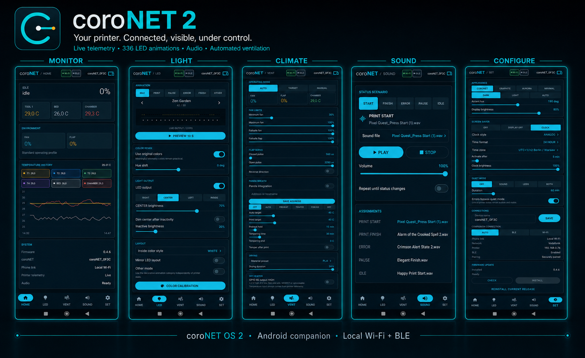
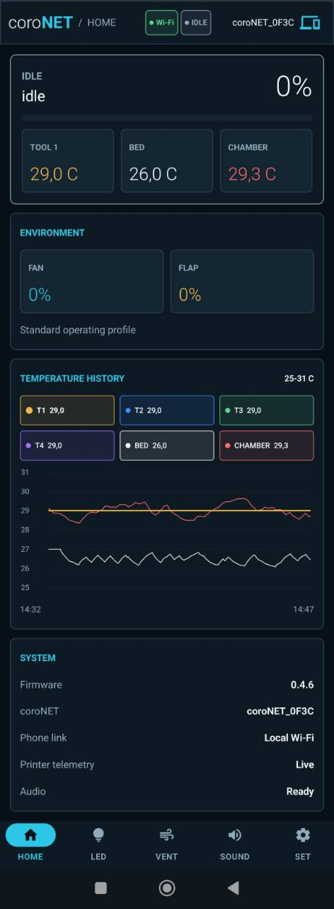
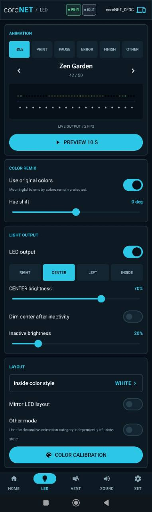
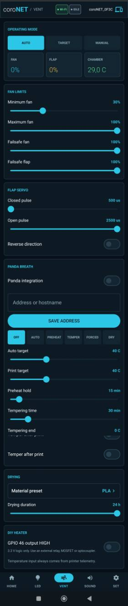
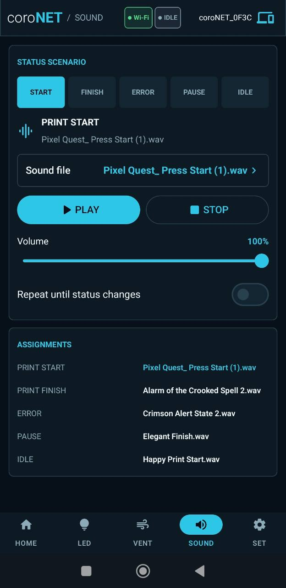
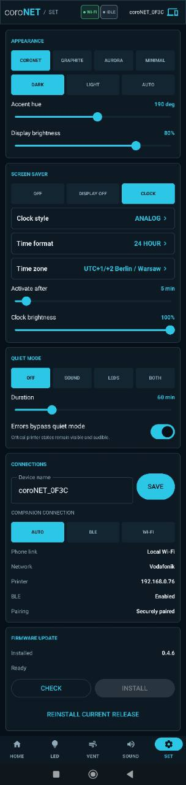

# coroNET Android Companion

This is the native Android reference client for coroNET OS 2. It mirrors structured device state rather than streaming the ESP32 display.

<p align="center">
  
</p>

## Current capabilities

- BLE discovery and framed protocol V2 reassembly;
- automatic first-pairing token transfer and encrypted per-device storage;
- multiple saved coroNET devices with fast selection;
- preferred authenticated local WiFi polling and settings control;
- automatic BLE reconnect and WiFi recovery through the stable mDNS hostname;
- encrypted per-device offline state and settings cache;
- local two-hour temperature history for all tools, the bed, and the chamber, with an interactive series legend;
- firmware-revision conflict handling for simultaneous touchscreen and phone edits;
- Home, LED, Vent, Sound, and Settings screens;
- phone-native portrait console UI matching the touchscreen's information hierarchy while using the larger mobile canvas;
- real firmware-driven LED animation previews and physical color calibration over BLE or WiFi;
- browsable microSD sound folders, per-status sound assignment, playback, stop, and library rescan over BLE or WiFi;
- synchronized device naming and companion transport selection;
- revisioned printer Error and Finish notifications without reconnect duplicates;
- Android 8.0 (API 26) and newer.

## App Screens

The portrait interface keeps live printer status and the most-used controls within comfortable reach while preserving the same coroNET visual language across the touchscreen, phone, and web panel.

> These are full scrolling captures of complete app sections, not single phone-screen viewports. Their different lengths reflect how much control and status information each section contains.

<table>
  <tr>
    <td width="33%"></td>
    <td width="33%"></td>
    <td width="33%"></td>
  </tr>
  <tr>
    <td align="center"><strong>Home</strong><br>Telemetry and temperature history</td>
    <td align="center"><strong>LED</strong><br>Animations and lighting</td>
    <td align="center"><strong>Vent</strong><br>Chamber climate control</td>
  </tr>
</table>

<table>
  <tr>
    <td width="50%"></td>
    <td width="50%"></td>
  </tr>
  <tr>
    <td align="center"><strong>Sound</strong><br>Audible printer status</td>
    <td align="center"><strong>Settings</strong><br>One place for the whole device</td>
  </tr>
</table>

## Install

Download the current signed [coroNET Companion APK](https://github.com/AlphaStudioDE/coroNET_OS_2/releases/latest/download/coroNET_Companion.apk), allow installation from the browser or file manager when Android asks, and open the app. Pair devices from the app's **Devices** screen instead of Android's generic Bluetooth settings.

Development APKs used before the public signed release may need to be uninstalled once because Android will not replace an app signed with a different key. Saved pairings from that development installation will then need to be created again.

## Build

Open this directory in Android Studio, or run from a terminal with JDK 17 and the Android SDK configured:

```powershell
.\gradlew.bat assembleDebug
```

The debug APK is generated at `app/build/outputs/apk/debug/app-debug.apk`.

Tagged GitHub releases are built with the project release key held in GitHub Secrets and publish `coroNET_Companion.apk` beside the matching firmware assets. No signing key or password is stored in this repository.

Physical-phone BLE testing remains part of the release validation checklist. The UI and application lifecycle are also exercised on the included minimum-SDK emulator during development.
