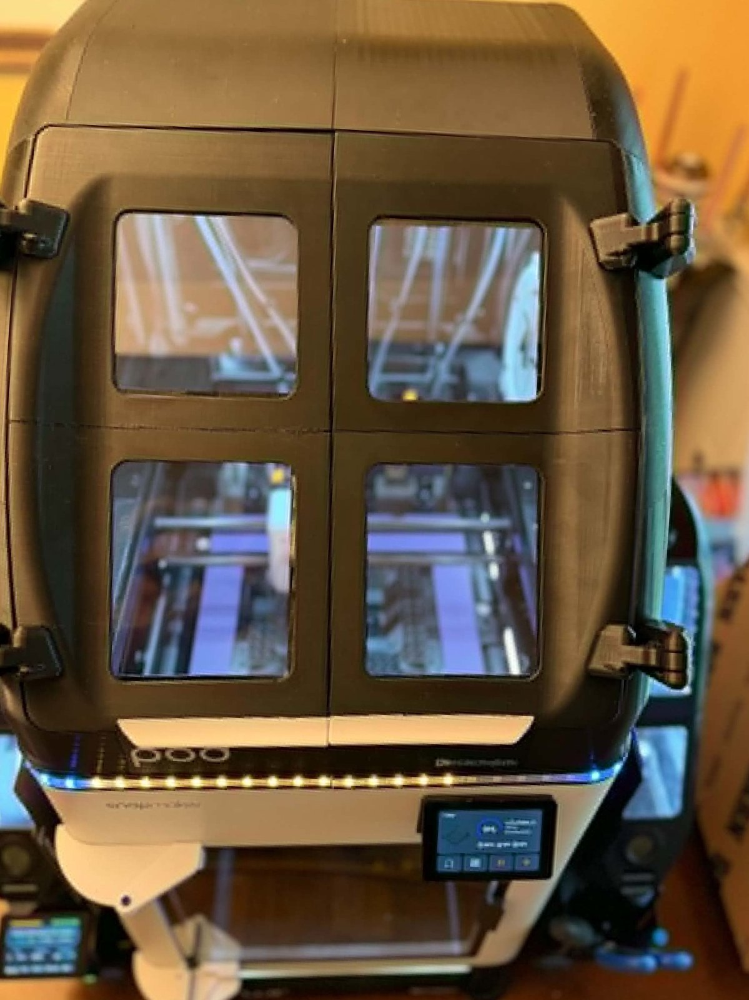
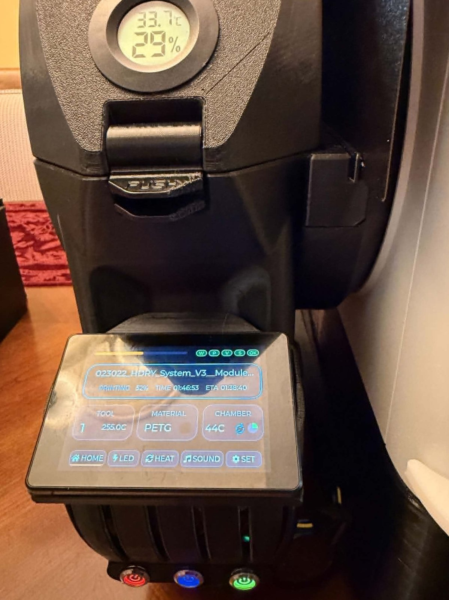
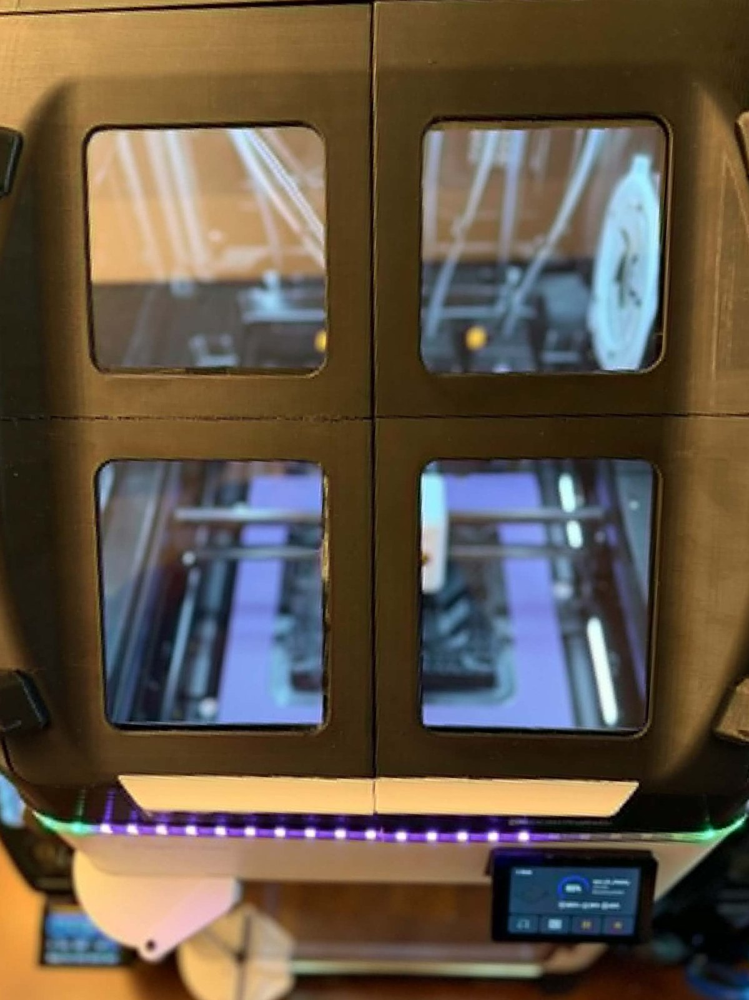
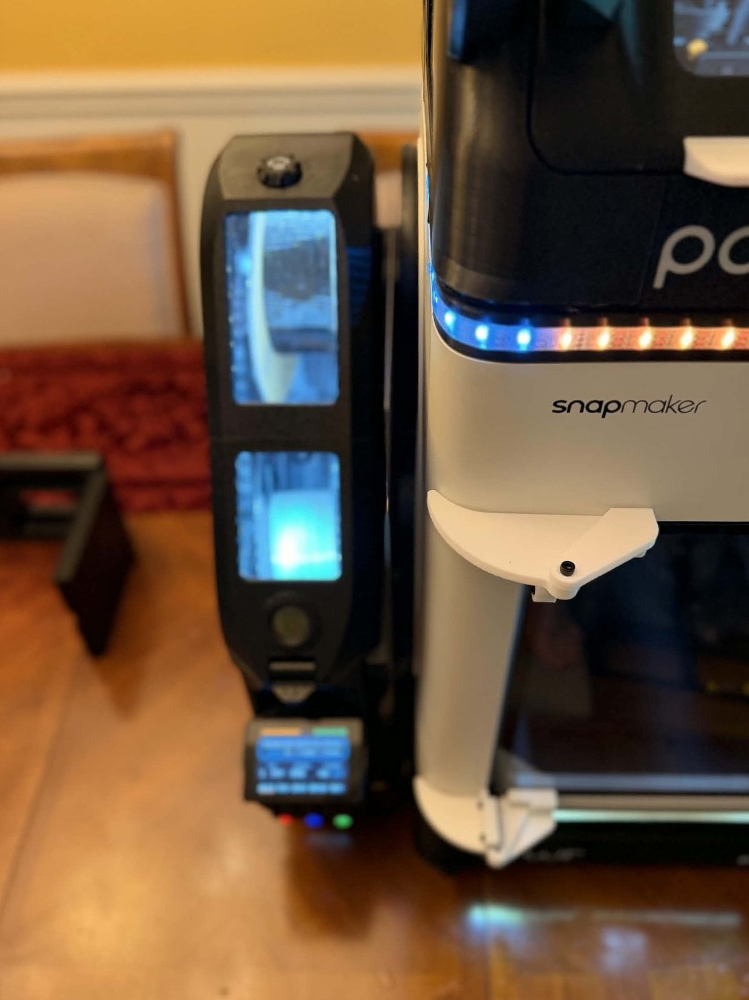
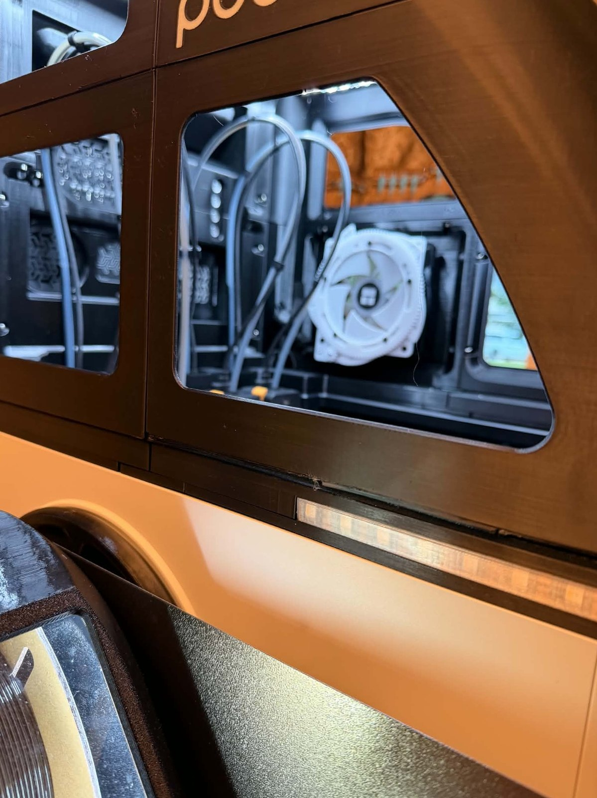
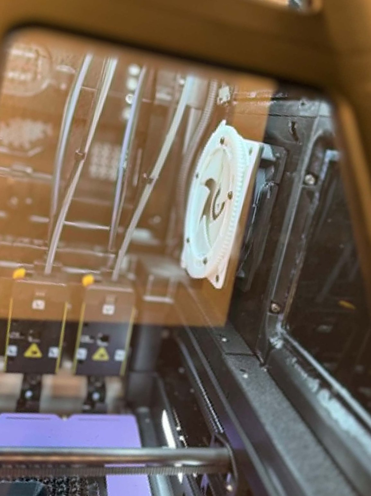

# Community Showcase

## coroNET in the Wild

coroNET is one physical device with two firmware generations. [coroNET OS 1](https://github.com/AlphaStudioDE/coroNET_OS_1) established the product and powers the community installation shown here. OS 2 is a ground-up, MIT-licensed rewrite for the same controller, enclosure, wiring, LEDs, audio, fan, and servo hardware.

coroNET was built to become part of a real workshop, not to remain a prototype on its creator's desk. This gallery celebrates community installations that adapt the platform to ambitious printers, personal workflows, and distinctive hardware builds.

### Four-Tool Workshop Build

**Built and photographed by Bobby Morgan.**

This extensively customized Snapmaker installation runs coroNET OS 1 on the same coroNET controller hardware targeted by OS 2. The build combines a four-tool filament system, environmental monitoring, active ventilation, a servo-controlled air path, RGBW status lighting, and a dedicated touchscreen interface.

The installation demonstrates the idea behind coroNET: printer telemetry should become useful, visible, and physical throughout the machine instead of remaining confined to a single status screen.

  

<table>
  <tr>
    <td width="50%"></td>
    <td width="50%"></td>
  </tr>
  <tr>
    <td align="center"><strong>Status lighting across the machine</strong></td>
    <td align="center"><strong>The customized POD enclosure</strong></td>
  </tr>
</table>

### Control And Feedback

The dedicated coroNET touchscreen presents live print state, progress, temperatures, active material, timing, and connectivity. RGBW lighting extends that information beyond the screen so printer state remains visible from across the room.

<table>
  <tr>
    <td width="50%"></td>
    <td width="50%"></td>
  </tr>
  <tr>
    <td width="50%"></td>
    <td width="50%"></td>
  </tr>
</table>

### Airflow And Material Handling

The build also shows why coroNET treats ventilation as a first-class subsystem. Four filament paths, active airflow, environmental sensing, and visible mechanical control work together around the printer rather than as isolated accessories.

<table>
  <tr>
    <td width="50%"></td>
    <td width="50%"></td>
  </tr>
  <tr>
    <td colspan="2" align="center"></td>
  </tr>
</table>

## Share Your Build

Community installations do not need to copy this machine. A clean standard build, a custom enclosure, a clever mounting solution, or an unusual printer integration can all become part of this showcase.

To submit a build, open a GitHub Discussion or issue with a short description, hardware notes, and photographs you have permission to publish. Please state how you would like to be credited.

---

This installation was built and photographed by **Bobby Morgan**, who granted permission to publish the images in the coroNET project gallery. The installation includes personal modifications and accessories beyond the standard coroNET bill of materials. coroNET is an independent community project and is not affiliated with or endorsed by Snapmaker.
